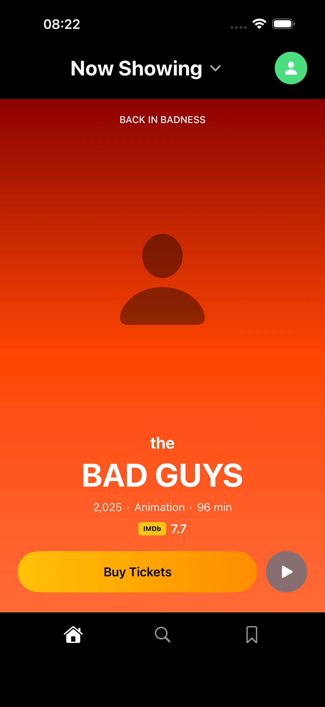
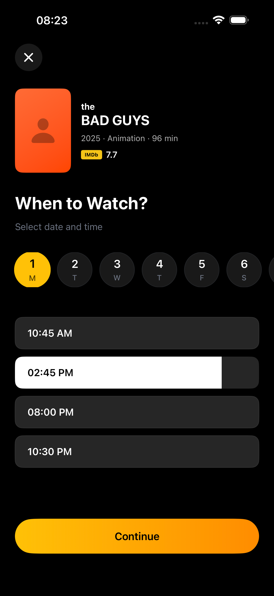
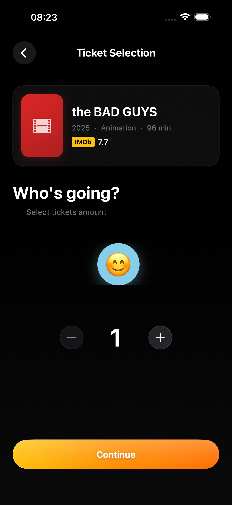
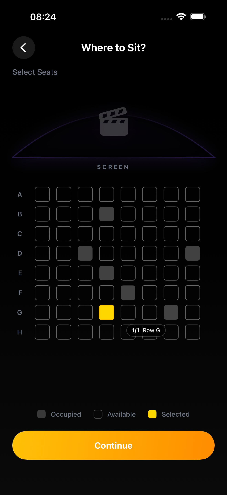
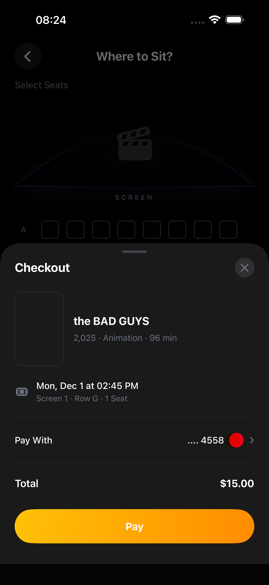
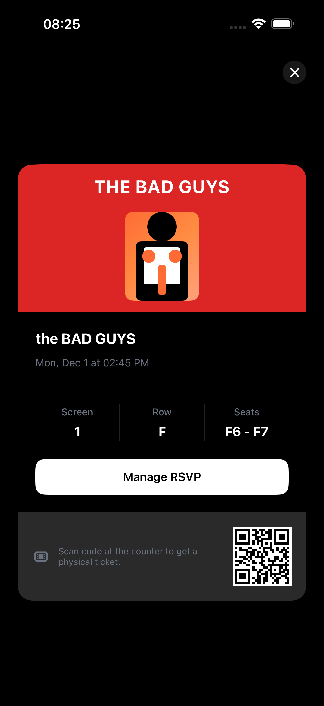
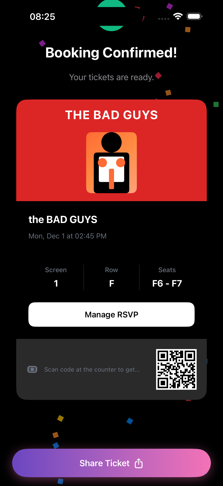

# BeetIOS

A modern cinema ticket booking application built with SwiftUI, following Apple's Human Interface Guidelines.

## Overview

BeetIOS provides a seamless movie booking experience with an intuitive interface, smooth animations, and comprehensive accessibility support. The app guides users through movie selection, showtime booking, seat selection, and payment processing.

## Screenshots

### Booking Flow

<div align="center">

**1. Movie Selection**


**2. Date & Time Selection**


**3. Ticket Selection**


**4. Seat Selection**


**5. Checkout**


**6. Ticket View**


**7. Booking Confirmed**


</div>

## Architecture

```
┌─────────────────────────────────────────────────────────┐
│                      ContentView                         │
│                  (Navigation Root)                       │
└────────────────────┬────────────────────────────────────┘
                     │
        ┌────────────┴────────────┐
        │                         │
┌───────▼────────┐      ┌─────────▼──────────┐
│ NowShowingView │      │   Router           │
│                │      │   (@Observable)    │
└───────┬────────┘      └─────────┬──────────┘
        │                         │
        └────────────┬────────────┘
                     │
        ┌────────────┴────────────┐
        │                         │
┌───────▼────────┐      ┌─────────▼──────────┐
│ MovieDetailView│      │ DateTimeSelection  │
│                │      │      View           │
└───────┬────────┘      └─────────┬──────────┘
        │                         │
        └────────────┬────────────┘
                     │
        ┌────────────┴────────────┐
        │                         │
┌───────▼────────┐      ┌─────────▼──────────┐
│TicketSelection │      │ SeatSelectionView  │
│     View       │      │                    │
└───────┬────────┘      └─────────┬──────────┘
        │                         │
        └────────────┬────────────┘
                     │
        ┌────────────┴────────────┐
        │                         │
┌───────▼────────┐      ┌─────────▼──────────┐
│  CheckoutView  │      │ TicketSuccessView  │
│                │      │                    │
└────────────────┘      └───────────────────┘
```

## Booking Flow

```
Movie Selection
      │
      ▼
Date & Time Selection
      │
      ▼
Ticket Quantity Selection
      │
      ▼
Seat Selection
      │
      ▼
Checkout & Payment
      │
      ▼
Booking Confirmation
```

## Features

### Core Functionality
- **Movie Discovery**: Browse movies with detailed information
- **Showtime Selection**: Choose date and time with visual calendar
- **Ticket Management**: Select multiple tickets with quantity controls
- **Interactive Seat Map**: Visual seat selection with real-time availability
- **Secure Checkout**: Multiple payment methods with validation
- **Booking Confirmation**: Animated success screen with ticket details

### Technical Highlights
- **Modern State Management**: Observation framework (`@Observable`)
- **Type-Safe Navigation**: NavigationStack with NavigationPath
- **Accessibility**: Full VoiceOver support and Dynamic Type
- **Performance**: Lazy loading and optimized rendering
- **Animations**: Smooth transitions and micro-interactions

## Project Structure

```
BeetIOS-App/
├── Models/              # Data models
│   ├── Movie.swift
│   ├── Booking.swift
│   ├── Seat.swift
│   └── PaymentMethod.swift
│
├── ViewModels/          # Business logic
│   ├── MovieViewModel.swift
│   ├── SeatSelectionViewModel.swift
│   ├── CheckoutViewModel.swift
│   └── ...
│
├── Views/               # SwiftUI views
│   ├── NowShowingView.swift
│   ├── MovieDetailView.swift
│   ├── SeatSelectionView.swift
│   ├── CheckoutView.swift
│   └── Shared/          # Reusable components
│
├── Navigation/          # Routing
│   └── Router.swift
│
├── Extensions/          # Utilities
│   ├── Color+Theme.swift
│   ├── DesignConstants.swift
│   └── View+Haptics.swift
│
└── Animations/          # Custom animations
    └── ConfettiView.swift
```

## Requirements

- iOS 17.0+
- Xcode 15.0+
- Swift 5.9+

## Getting Started

1. Clone the repository
   ```bash
   git clone https://github.com/Yash-bharadwaj/IOSapp-Beet.git
   cd IOSapp-Beet
   ```

2. Open in Xcode
   ```bash
   open BeetIOS-App.xcodeproj
   ```

3. Build and run
   - Select target device or simulator
   - Press `Cmd + R` to build and run

## Technologies

- **SwiftUI** - Declarative UI framework
- **Observation** - Modern state management
- **NavigationStack** - Type-safe navigation
- **Combine** - Reactive programming

## Design Principles

- **Consistency**: Unified design language
- **Accessibility**: WCAG compliant, VoiceOver ready
- **Performance**: Optimized for 60fps animations
- **User Experience**: Intuitive interactions with haptic feedback

## Code Quality

- Clean architecture with MVVM pattern
- Comprehensive documentation
- Type-safe implementations
- Accessibility-first approach
- Performance optimized

---

**Developed by Yashwanth Bharadwaj**

*Building premium iOS experiences*
